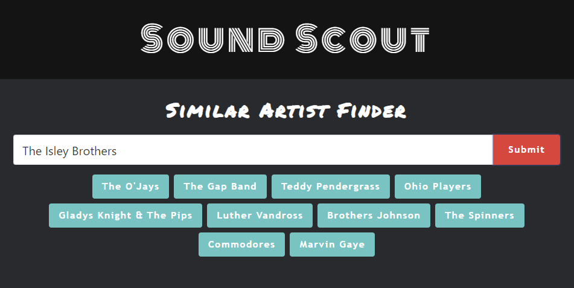
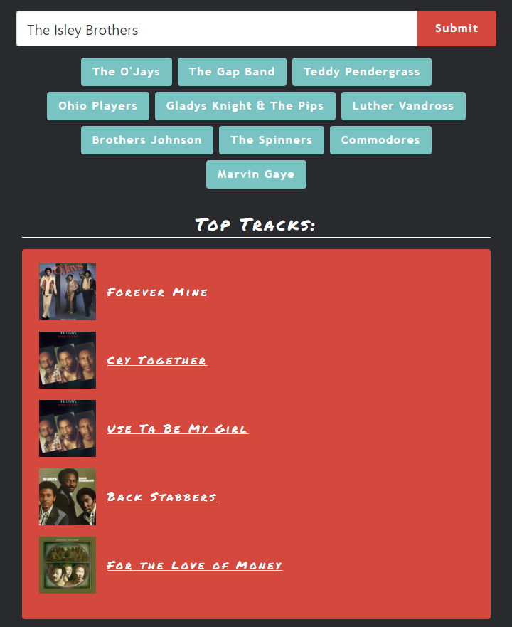

# Sound Scout

An interactive music discovery application that takes user input of their favorite musicians and dynamically presents the user with a list of similar artists, as well as links to their top songs, lyrics, music videos, and upcoming concerts.   

## Table of Contents

1. [Usage](#usage)
2. [Screenshots](#screenshots)
3. [Collaborators](#collaborators)
4. [Technologies](#technologies)
5. [Badges](#badges)

## Usage

visit: 

https://nsettyy.github.io/sound-scout/

When a artist/band name is submitted in the input field, a button list of similar artists is rendered. When the user clicks on a similar artist button, links to that artist/band's top songs will display on the page for the user to listen to previews, watch music videos, sing along with lyrics, and book concert tickets.  

The application will save each user input so if the page reloads for any reason, the last artist queried will display similar artists on the page. 

## Screenshots

## Collaborators

- **[Angel Gonzalez](https://github.com/Utero93)**: Researched and verified a working API to fetch data from the Last FM API for finding similar artists, and helped with coding the application's functionality using JS.

- **[Nick Settembrino](https://github.com/nsettyy)**: Researched and verified a working API to fetch data from the Shazam API for rending similar artist top songs, and helped with coding the application's functionality using JS.

- **[Tom Dossman](https://github.com/Dossman-thomas)**: created the framework, design, and css styling for the application.  Also, contributed with coding the application's functionality using JS.

- **[Zoe Keegan](https://github.com/zoekeegan)**: Worked on local storage functionality using JS.

## Technologies

This project is built using the following technologies:

- **HTML**

- **CSS**

- **JavaScript**

- **Framework:** [Bulma CSS](https://bulma.io/)

- **APIs:** [Last FM](https://www.last.fm/api)

- **APIs:** [Shazam](https://www.shazam.com/shazamkit)

## Badges

